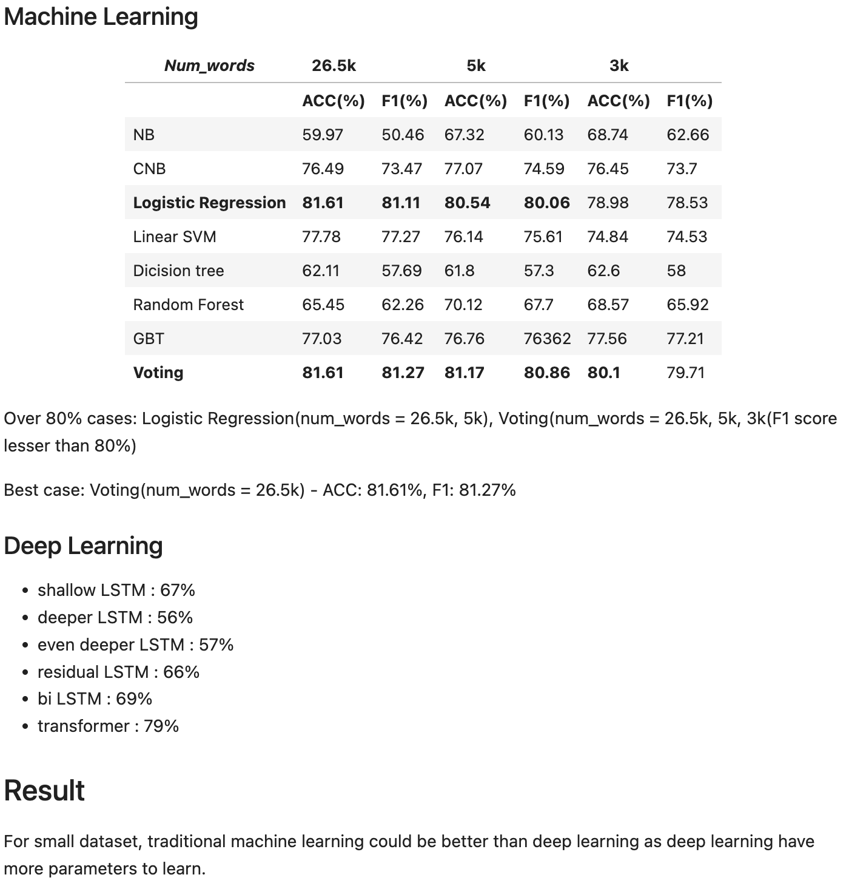

# AIFFEL Campus Online 5th Code Peer Review
- 코더 : 황인준
- 리뷰어 : 윤상현

# PRT(PeerReviewTemplate) 
각 항목을 스스로 확인하고 토의하여 작성한 코드에 적용합니다.



- [O] 코드가 정상적으로 동작하고 주어진 문제를 해결했나요?
  > 넵 좋았습니다!
- [O] 주석을 보고 작성자의 코드가 이해되었나요?
  > 넵 직관적인 코드들이 좋았습니다.
- [O] 코드가 에러를 유발할 가능성이 없나요?
  > 없을것으로 사료됩니다.
- [O] 코드 작성자가 코드를 제대로 이해하고 작성했나요?
  > 네 무엇보다 Deeplearning과의 비교에서 여러가지 시도를 해보신 부분이 너무 좋았습니다.
  > 가장 아래쪽에 Summary 또한 간결하게 잘 정리돼있어서 결과를 알기 쉬웠습니다.
- [O] 코드가 간결한가요?
  > 네. 레이어를 쌓는 과정에서도 간결하고 이해하기 쉽게 구성됐습니다.


# 참고 링크 및 코드 개선
```python
-
```
