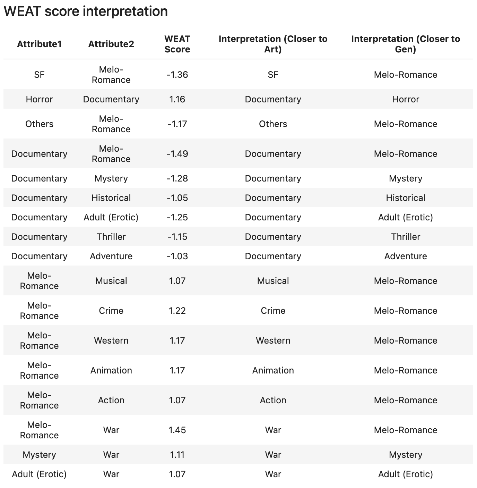

# AIFFEL Campus Online 5th Code Peer Review
- 코더 : 황인준
- 리뷰어 : 윤상현



# PRT(PeerReviewTemplate) 
각 항목을 스스로 확인하고 토의하여 작성한 코드에 적용합니다.

- [O] 코드가 정상적으로 동작하고 주어진 문제를 해결했나요?
  > 1. 주어진 영화 코퍼스를 바탕으로 워드임베딩 모델을 정상적으로 만듬
  > 2. 영화 구분, 장르별로 target, attribute에 대한 대표성있는 단어 셋을 생성
  > 3. WEAT score 계산 및 시각화
  
  > 네, 모두 해결하였습니다.
- [O] 주석을 보고 작성자의 코드가 이해되었나요?
  > 네, 이해가 힘들 수 있는 부분에 주석이 적절하게 달려있었습니다.
- [O] 코드가 에러를 유발할 가능성이 없나요?
  > 없을 것으로 보입니다.
- [O] 코드 작성자가 코드를 제대로 이해하고 작성했나요?
  > 네
- [O] 코드가 간결한가요?
  > 네, 깔끔합니다.

# 예시
1. 코드의 작동 방식을 주석으로 기록합니다.
2. 코드의 작동 방식에 대한 개선 방법을 주석으로 기록합니다.
3. 참고한 링크 및 ChatGPT 프롬프트 명령어가 있다면 주석으로 남겨주세요.
4. 좋았던 코드
```python
## 시각화와 함께 전체적인 WEAT 점수를 볼 수 있어서 좋았습니다.

significant_pairs = []
for i in range(len(genre_name)-1):
    for j in range(i+1, len(genre_name)):
        if matrix[i][j] > 1 or matrix[i][j] < -1:
            significant_pairs.append((genre_name[i], genre_name[j], matrix[i][j]))

significant_pairs

```

# 참고 링크 및 코드 개선
```python
# 코드 리뷰 시 참고한 링크가 있다면 링크와 간략한 설명을 첨부합니다.
# 코드 리뷰를 통해 개선한 코드가 있다면 코드와 간략한 설명을 첨부합니다.


```
